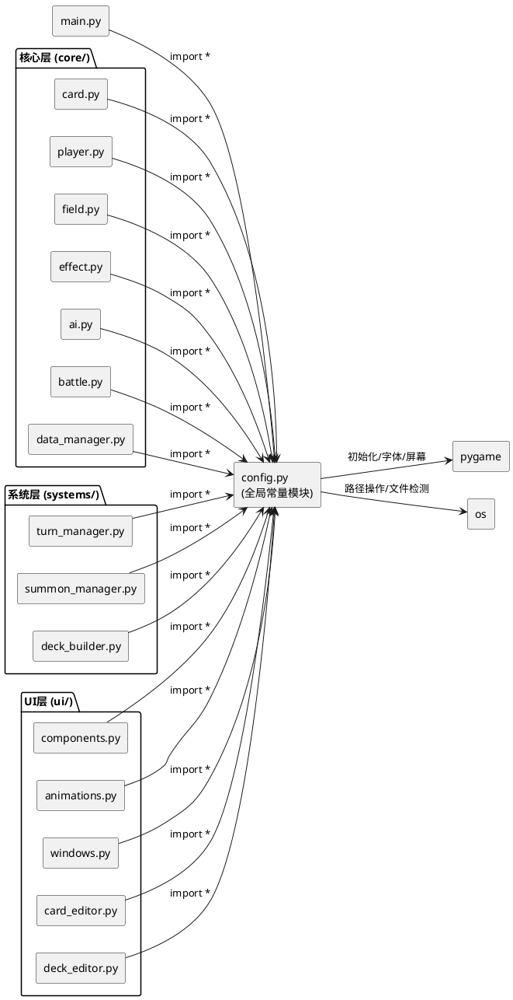

# **1. 实现模型**

## **1.1 上下文视图**

config.py 作为卡牌游戏的全局常量配置模块，被项目中 13 个模块通过 `from config import *` 引用。其核心职责是提供屏幕尺寸、卡牌尺寸、颜色、字体、资源路径等常量定义，并实现健壮的字体加载回退机制。



## **1.2 服务/组件总体架构**

config.py 模块内部划分为四个逻辑区域，按依赖顺序依次初始化：

```plantuml
@startuml
package "config.py 内部架构" {

    rectangle "1. pygame 初始化层" as init {
        note : pygame.init()
    }

    rectangle "2. 基础常量层\n(无外部依赖)" as base {
        note : SCREEN_WIDTH, SCREEN_HEIGHT\nFPS, CARD_WIDTH, CARD_HEIGHT\nHAND_MAX, 颜色常量
    }

    rectangle "3. 资源路径层\n(依赖 os)" as paths {
        note : ASSETS_DIR, SOUND_DIR\nIMAGE_DIR
    }

    rectangle "4. 字体加载层\n(依赖 pygame + os)" as fonts {
        rectangle "get_font(size)" as getfont
        note : FONT_SMALL, FONT_MID\nFONT_BIG
    }
}

init --> base : pygame 就绪
base --> paths : 无依赖
paths --> fonts : 路径就绪

@enduml
```

**初始化顺序说明**：

1. **pygame 初始化层**：调用 `pygame.init()` 确保字体子系统可用，必须在任何字体对象创建前完成
2. **基础常量层**：定义屏幕尺寸、卡牌尺寸、帧率、手牌上限和颜色常量，这些常量不依赖任何外部资源
3. **资源路径层**：基于 `ASSETS_DIR` 派生 `SOUND_DIR` 和 `IMAGE_DIR`，依赖 `os.path.join`
4. **字体加载层**：通过 `get_font()` 函数实现回退加载，依赖 pygame 字体子系统和 os 文件检测

## **1.3 实现设计文档**

### **1.3.1 常量定义完整性修复**

**问题分析**：当前 config.py 已定义了 spec.md 中要求的所有常量名称，但存在以下问题：

- 字体常量被重复定义：第 24-26 行使用 `pygame.font.Font(None, size)` 定义了 `FONT_BIG`、`FONT_MID`、`FONT_SMALL`，随后第 47-49 行又使用 `get_font()` 重新定义了同名常量，后者覆盖前者
- `get_font()` 函数的 `except` 子句使用裸 `except`，不符合类型安全要求
- 缺少字体缓存机制，每次调用 `get_font()` 都会重新遍历文件系统

**修复策略**：

1. 移除第 24-26 行的冗余字体常量定义（使用 `pygame.font.Font(None, size)` 的版本）
2. 保留 `get_font()` 函数及其生成的字体常量作为唯一定义
3. 为 `get_font()` 添加字体缓存机制，使用字典缓存已加载的字体对象
4. 将裸 `except` 替换为 `except Exception`，并添加日志记录

### **1.3.2 字体加载回退机制设计**

**回退策略**：`get_font(size)` 函数按以下优先级依次尝试加载字体：

| 优先级 | 字体路径 | 说明 |
|--------|---------|------|
| 1 | `C:/Windows/Fonts/msyh.ttc` | 微软雅黑（Windows 系统中文字体） |
| 2 | `C:/Windows/Fonts/simhei.ttf` | 黑体（Windows 系统中文字体） |
| 3 | `assets/font.ttf` | 项目本地字体文件 |
| 4 | `pygame.font.Font(None, size)` | pygame 内置默认字体（最终回退） |

**缓存设计**：

- 使用模块级字典 `_font_cache: Dict[int, pygame.font.Font]` 缓存已加载字体
- 缓存键为字号 `size`，值为对应的 `pygame.font.Font` 对象
- 缓存无上限（字号种类有限，通常不超过 10 种），不会导致内存泄漏

### **1.3.3 常量值合理性保障**

根据 spec.md 数据约束，常量值需满足以下条件：

| 常量 | 推荐值 | 约束 |
|------|--------|------|
| SCREEN_WIDTH | 1380 | ≥ 1024，宽高比 16:9 ~ 16:10 |
| SCREEN_HEIGHT | 900 | ≥ 768 |
| FPS | 60 | [30, 120] |
| CARD_WIDTH | 100 | [80, 150] |
| CARD_HEIGHT | 140 | [100, 200]，且 > CARD_WIDTH |
| HAND_MAX | 10 | [1, 20] |
| 颜色常量 | 见 spec.md | RGB 各分量 [0, 255] |
| FONT_SMALL | get_font(18) | 字号 < FONT_MID |
| FONT_MID | get_font(28) | 字号 < FONT_BIG |
| FONT_BIG | get_font(50) | 最大字号 |

当前 config.py 中的常量值已满足上述约束，无需调整。

---

# **2. 接口设计**

## **2.1 总体设计**

config.py 作为纯常量模块，对外暴露的接口分为两类：

1. **常量导出**：通过 `from config import *` 方式被各模块引用的顶层变量
2. **函数导出**：`get_font(size)` 函数供需要动态字号的场景调用

所有常量在模块加载时完成初始化，无需延迟加载或懒初始化。

## **2.2 接口清单**

### **2.2.1 屏幕与帧率常量**

| 常量名 | 类型 | 值 | 说明 |
|--------|------|----|------|
| SCREEN_WIDTH | int | 1380 | 游戏窗口宽度（像素） |
| SCREEN_HEIGHT | int | 900 | 游戏窗口高度（像素） |
| FPS | int | 60 | 游戏目标帧率 |

### **2.2.2 卡牌尺寸常量**

| 常量名 | 类型 | 值 | 说明 |
|--------|------|----|------|
| CARD_WIDTH | int | 100 | 卡牌宽度（像素） |
| CARD_HEIGHT | int | 140 | 卡牌高度（像素） |
| HAND_MAX | int | 10 | 玩家手牌数量上限 |

### **2.2.3 颜色常量**

| 常量名 | 类型 | 值 | 说明 |
|--------|------|----|------|
| WHITE | Tuple[int, int, int] | (255, 255, 255) | 白色 |
| BLACK | Tuple[int, int, int] | (0, 0, 0) | 黑色 |
| RED | Tuple[int, int, int] | (255, 0, 0) | 红色 |
| GREEN | Tuple[int, int, int] | (0, 255, 0) | 绿色 |
| BLUE | Tuple[int, int, int] | (0, 0, 255) | 蓝色 |
| YELLOW | Tuple[int, int, int] | (255, 255, 0) | 黄色 |
| GRAY | Tuple[int, int, int] | (100, 100, 100) | 灰色 |
| DARK_BLUE | Tuple[int, int, int] | (20, 20, 50) | 深蓝色 |
| LIGHT_BLUE | Tuple[int, int, int] | (180, 180, 255) | 浅蓝色 |
| LIGHT_RED | Tuple[int, int, int] | (255, 180, 180) | 浅红色 |
| ORANGE | Tuple[int, int, int] | (255, 165, 0) | 橙色 |

### **2.2.4 字体常量**

| 常量名 | 类型 | 值 | 说明 |
|--------|------|----|------|
| FONT_SMALL | pygame.font.Font | get_font(18) | 小号字体，用于辅助信息 |
| FONT_MID | pygame.font.Font | get_font(28) | 中号字体，用于正文 |
| FONT_BIG | pygame.font.Font | get_font(50) | 大号字体，用于标题 |

### **2.2.5 资源路径常量**

| 常量名 | 类型 | 值 | 说明 |
|--------|------|----|------|
| ASSETS_DIR | str | "assets" | 资源根目录 |
| SOUND_DIR | str | os.path.join(ASSETS_DIR, "sounds") | 音效目录 |
| IMAGE_DIR | str | os.path.join(ASSETS_DIR, "images") | 图片目录 |

### **2.2.6 字体加载函数**

| 函数签名 | 返回类型 | 说明 |
|---------|---------|------|
| `get_font(size: int) -> pygame.font.Font` | pygame.font.Font | 按回退策略加载指定字号的字体对象 |

**函数行为规范**：

- **输入**：`size` — 正整数，表示字体字号
- **输出**：可调用 `render()` 方法的 `pygame.font.Font` 对象，保证永不返回 None
- **回退逻辑**：按优先级依次尝试候选字体路径，所有路径均失败时回退到 `pygame.font.Font(None, size)`
- **缓存行为**：相同 `size` 参数的重复调用直接返回缓存对象，不重复访问文件系统
- **异常处理**：字体文件损坏时捕获 `Exception`，跳过该候选路径继续尝试

---

# **4. 数据模型**

## **4.1 设计目标**

config.py 的数据模型设计目标：

1. **零运行时开销**：所有常量在模块加载时一次性初始化，运行时无额外计算
2. **类型安全**：每个常量具有明确的类型约束，避免类型混淆导致的运行时错误
3. **字体缓存可控**：缓存字典生命周期与模块一致，不会因重复调用导致内存增长

## **4.2 模型实现**

### **4.2.1 字体缓存模型**

```python
# 模块级字体缓存
_font_cache: Dict[int, pygame.font.Font] = {}

def get_font(size: int) -> pygame.font.Font:
    """
    按回退策略加载指定字号的字体对象。
    
    Args:
        size: 字体字号（正整数）
    
    Returns:
        pygame.font.Font: 可用的字体对象，保证不返回 None
    """
    if size in _font_cache:
        return _font_cache[size]
    
    font_paths = [
        "C:/Windows/Fonts/msyh.ttc",
        "C:/Windows/Fonts/simhei.ttf",
        "assets/font.ttf"
    ]
    
    for path in font_paths:
        if os.path.exists(path):
            try:
                font = pygame.font.Font(path, size)
                _font_cache[size] = font
                return font
            except Exception:
                continue
    
    font = pygame.font.Font(None, size)
    _font_cache[size] = font
    return font
```

### **4.2.2 常量定义顺序模型**

config.py 中常量的定义必须严格遵循以下顺序，确保依赖关系正确：

```
1. import pygame, os
2. pygame.init()
3. 屏幕尺寸常量: SCREEN_WIDTH, SCREEN_HEIGHT, FPS
4. 颜色常量: WHITE, BLACK, RED, GREEN, BLUE, YELLOW, GRAY, DARK_BLUE, LIGHT_BLUE, LIGHT_RED, ORANGE
5. 卡牌尺寸常量: CARD_WIDTH, CARD_HEIGHT, HAND_MAX
6. get_font() 函数定义（含 _font_cache）
7. 字体常量: FONT_SMALL, FONT_MID, FONT_BIG（通过 get_font() 生成）
8. 资源路径常量: ASSETS_DIR, SOUND_DIR, IMAGE_DIR
```

**关键约束**：

- `pygame.init()` 必须在 `get_font()` 调用之前执行，否则 pygame 字体子系统未初始化将导致异常
- 字体常量必须在 `get_font()` 函数定义之后生成，不可使用 `pygame.font.Font(None, size)` 提前定义
- 资源路径常量不依赖 pygame，可放在模块末尾，但建议保持现有位置以维持与项目其他模块的兼容性

### **4.2.3 常量类型约束汇总**

| 常量类别 | 类型约束 | 校验规则 |
|---------|---------|---------|
| 屏幕尺寸 | int | ≥ 最小值，SCREEN_WIDTH/SCREEN_HEIGHT 宽高比在 16:9~16:10 |
| 卡牌尺寸 | int | 在指定范围内，CARD_HEIGHT > CARD_WIDTH |
| 手牌上限 | int | [1, 20] |
| 颜色常量 | Tuple[int, int, int] | 各分量 [0, 255] |
| 字体常量 | pygame.font.Font | 可调用 render() 方法 |
| 资源路径 | str | 非空字符串 |
| FPS | int | [30, 120] |