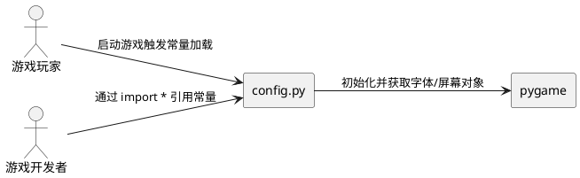
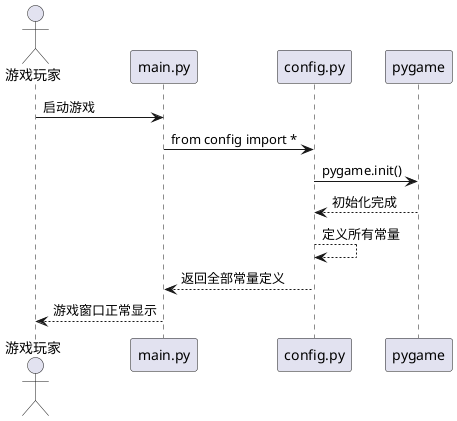
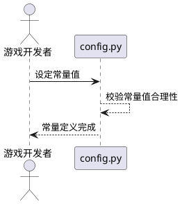
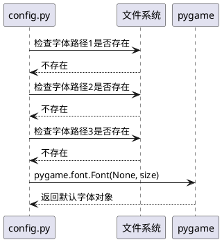

# **1. 组件定位**

## **1.1 核心职责**

本组件负责定义并维护卡牌游戏全局常量，消除因常量未定义导致的 NameError 闪退问题。

## **1.2 核心输入**

1. 项目各模块通过 `from config import *` 发起的常量导入请求
2. 用户启动游戏时对屏幕、卡牌、颜色、字体等基础配置的隐式依赖

## **1.3 核心输出**

1. 所有被项目模块引用的全局常量定义（屏幕尺寸、卡牌尺寸、手牌上限、颜色常量、字体常量、资源路径等）
2. 字体加载函数 `get_font(size)` 返回的可用字体对象

## **1.4 职责边界**

1. 不负责游戏逻辑、渲染逻辑或业务规则的实现
2. 不负责动态配置的加载或运行时配置变更
3. 不负责常量值的用户自定义（如设置面板中的分辨率调整）

---

# **2. 领域术语**

**全局常量**
: 在 config.py 中定义的、被项目多个模块通过 `from config import *` 引用的顶层变量，包括屏幕尺寸、卡牌尺寸、手牌上限、颜色元组、字体对象和资源路径。

**闪退**
: 程序因 Python NameError 异常未捕获而直接终止运行的现象，用户表现为窗口瞬间关闭无任何提示。

**字体回退**
: 当首选字体文件不存在时，依次尝试备选字体路径，最终回退到 pygame 默认字体的加载策略。

**常量完整性**
: config.py 中定义的常量集合完全覆盖所有被项目模块引用的常量名称，不存在任何缺失定义。

---

# **3. 角色与边界**

## **3.1 核心角色**

- **游戏开发者**：编写和维护项目各模块代码，通过 `from config import *` 引用全局常量
- **游戏玩家**：启动并运行游戏，期望程序正常启动不闪退

## **3.2 外部系统**

- **pygame**：提供屏幕创建、字体渲染、颜色定义等基础能力，config.py 依赖其初始化

## **3.3 交互上下文**

---

# **4. DFX约束**

## **4.1 性能**

1. config.py 模块加载时间不得超过 100ms
2. 字体回退查找不得超过 3 次文件系统访问

## **4.2 可靠性**

1. 系统可用性目标：游戏启动阶段不得因常量未定义而抛出 NameError
2. 字体加载必须保证至少返回一个可用字体对象，禁止返回 None

## **4.3 安全性**

1. 字体文件路径仅限本地系统路径，禁止从网络加载

## **4.4 可维护性**

1. 所有新增常量必须在 config.py 中集中定义，禁止分散到其他模块
2. 常量命名必须使用大写蛇形命名法（UPPER_SNAKE_CASE）

## **4.5 兼容性**

1. 常量值必须兼容 pygame 2.x 系列
2. 字体回退路径必须覆盖 Windows 系统常见中文字体位置

---

# **5. 核心能力**

## **5.1 常量定义完整性保障**

### **5.1.1 业务规则**

1. **屏幕尺寸常量必须定义**：config.py 必须定义 SCREEN_WIDTH 和 SCREEN_HEIGHT 两个常量，分别表示游戏窗口的宽度和高度（单位：像素）

   a. 验收条件：[任何模块引用 SCREEN_WIDTH / SCREEN_HEIGHT] → [返回有效的正整数值，不抛出 NameError]

2. **卡牌尺寸常量必须定义**：config.py 必须定义 CARD_WIDTH 和 CARD_HEIGHT 两个常量，分别表示卡牌的宽度和高度（单位：像素）

   a. 验收条件：[任何模块引用 CARD_WIDTH / CARD_HEIGHT] → [返回有效的正整数值，不抛出 NameError]

3. **手牌上限常量必须定义**：config.py 必须定义 HAND_MAX 常量，表示玩家手牌数量上限

   a. 验收条件：[任何模块引用 HAND_MAX] → [返回有效的正整数值，不抛出 NameError]

4. **颜色常量必须定义**：config.py 必须定义以下颜色常量：BLUE、RED、GREEN、YELLOW、WHITE、DARK_BLUE、BLACK、GRAY、LIGHT_BLUE、LIGHT_RED、ORANGE，每个常量值为 RGB 三元组

   a. 验收条件：[任何模块引用上述颜色常量] → [返回包含 3 个 0-255 整数的元组，不抛出 NameError]

5. **字体常量必须定义**：config.py 必须定义 FONT_BIG、FONT_MID、FONT_SMALL 三个常量，每个常量值为可用的 pygame.font.Font 对象

   a. 验收条件：[任何模块引用 FONT_BIG / FONT_MID / FONT_SMALL] → [返回可调用 render() 方法的字体对象，不抛出 NameError]

6. **资源路径常量必须定义**：config.py 必须定义 ASSETS_DIR、SOUND_DIR、IMAGE_DIR 三个常量，表示资源目录路径

   a. 验收条件：[任何模块引用上述路径常量] → [返回有效的字符串路径，不抛出 NameError]

7. **帧率常量必须定义**：config.py 必须定义 FPS 常量，表示游戏目标帧率

   a. 验收条件：[任何模块引用 FPS] → [返回有效的正整数值，不抛出 NameError]

8. **禁止项**：config.py 中禁止存在未初始化即被使用的常量名

   a. 验收条件：[项目所有 .py 文件中 from config import * 后引用的名称] → [均在 config.py 中有定义，不抛出 NameError]

### **5.1.2 交互流程**

### **5.1.3 异常场景**

1. **常量未定义导致 NameError**

   a. 触发条件：某模块通过 `from config import *` 引用的常量在 config.py 中未定义

   b. 系统行为：程序在导入阶段抛出 NameError 异常并终止

   c. 用户感知：游戏窗口闪退，无任何错误提示

2. **字体文件不存在导致字体加载失败**

   a. 触发条件：config.py 中 get_font() 函数所有候选字体路径均不存在

   b. 系统行为：回退到 pygame.font.Font(None, size) 使用默认字体

   c. 用户感知：字体显示为默认样式，游戏正常运行不闪退

3. **pygame 未初始化即创建字体对象**

   a. 触发条件：在 pygame.init() 调用之前尝试创建字体对象

   b. 系统行为：pygame 抛出异常

   c. 用户感知：游戏窗口闪退

---

## **5.2 常量值合理性保障**

### **5.2.1 业务规则**

1. **屏幕尺寸必须适配卡牌游戏布局**：SCREEN_WIDTH 不得小于 1024，SCREEN_HEIGHT 不得小于 768，且宽高比应在 16:9 至 16:10 之间

   a. 验收条件：[游戏启动后创建窗口] → [窗口尺寸满足上述约束，所有 UI 元素可见不溢出]

2. **卡牌尺寸必须适合手牌区域显示**：CARD_WIDTH 不得小于 80 且不得大于 150，CARD_HEIGHT 不得小于 100 且不得大于 200，且 CARD_HEIGHT 应大于 CARD_WIDTH

   a. 验收条件：[卡牌在屏幕上渲染] → [卡牌比例合理，文字和图像可读]

3. **手牌上限必须为正整数**：HAND_MAX 不得小于 1 且不得大于 20

   a. 验收条件：[玩家手牌数达到 HAND_MAX] → [不再抽牌，手牌区域不溢出]

4. **颜色常量值必须在合法 RGB 范围内**：每个颜色常量的 R、G、B 分量必须为 0 到 255 之间的整数

   a. 验收条件：[使用颜色常量进行渲染] → [pygame 正常接受颜色值，不抛出异常]

5. **字体尺寸必须递增**：FONT_SMALL 对应字号 < FONT_MID 对应字号 < FONT_BIG 对应字号

   a. 验收条件：[使用三种字体渲染同一文本] → [文本像素尺寸依次增大]

6. **FPS 必须为合理帧率**：FPS 不得小于 30 且不得大于 120

   a. 验收条件：[游戏主循环运行] → [帧率稳定在 FPS 附近，画面流畅无卡顿]

### **5.2.2 交互流程**

### **5.2.3 异常场景**

1. **常量值超出合理范围**

   a. 触发条件：SCREEN_WIDTH 设为小于 1024 的值

   b. 系统行为：游戏窗口创建后 UI 元素溢出或重叠

   c. 用户感知：界面布局错乱，部分元素不可见

---

## **5.3 字体加载健壮性保障**

### **5.3.1 业务规则**

1. **字体加载必须实现回退机制**：get_font() 函数必须按优先级依次尝试多个字体路径，所有路径均失败时必须回退到 pygame 默认字体

   a. 验收条件：[系统中不存在任何指定字体文件] → [get_font() 返回 pygame 默认字体对象，不抛出异常]

2. **字体候选路径必须包含 Windows 中文常用字体**：候选路径列表必须包含 msyh.ttc（微软雅黑）和 simhei.ttf（黑体）

   a. 验收条件：[在 Windows 系统上运行] → [优先加载系统中文字体，中文文本正常显示]

3. **字体缓存不得导致内存泄漏**：get_font() 函数可以缓存已加载字体对象，但缓存大小必须有上限

   a. 验收条件：[多次调用 get_font() 加载不同字号] → [内存占用稳定，不持续增长]

### **5.3.2 交互流程**

### **5.3.3 异常场景**

1. **字体文件存在但格式损坏**

   a. 触发条件：候选字体路径指向的文件存在但无法被 pygame 解析

   b. 系统行为：捕获异常，继续尝试下一个候选路径

   c. 用户感知：字体显示为回退字体样式，游戏正常运行不闪退

---

# **6. 数据约束**

## **6.1 屏幕尺寸常量**

1. **SCREEN_WIDTH**：正整数，单位为像素，最小值 1024，推荐值 1380
2. **SCREEN_HEIGHT**：正整数，单位为像素，最小值 768，推荐值 900
3. **FPS**：正整数，单位为帧/秒，取值范围 [30, 120]，推荐值 60

## **6.2 卡牌尺寸常量**

1. **CARD_WIDTH**：正整数，单位为像素，取值范围 [80, 150]，推荐值 100
2. **CARD_HEIGHT**：正整数，单位为像素，取值范围 [100, 200]，推荐值 140

## **6.3 手牌上限常量**

1. **HAND_MAX**：正整数，取值范围 [1, 20]，推荐值 10

## **6.4 颜色常量**

1. **WHITE**：RGB 三元组，推荐值 (255, 255, 255)
2. **BLACK**：RGB 三元组，推荐值 (0, 0, 0)
3. **RED**：RGB 三元组，推荐值 (255, 0, 0)
4. **GREEN**：RGB 三元组，推荐值 (0, 255, 0)
5. **BLUE**：RGB 三元组，推荐值 (0, 0, 255)
6. **YELLOW**：RGB 三元组，推荐值 (255, 255, 0)
7. **GRAY**：RGB 三元组，推荐值 (100, 100, 100)
8. **DARK_BLUE**：RGB 三元组，推荐值 (20, 20, 50)
9. **LIGHT_BLUE**：RGB 三元组，推荐值 (180, 180, 255)
10. **LIGHT_RED**：RGB 三元组，推荐值 (255, 180, 180)
11. **ORANGE**：RGB 三元组，推荐值 (255, 165, 0)

## **6.5 字体常量**

1. **FONT_BIG**：pygame.font.Font 对象，对应字号 50，用于标题和大号文本渲染
2. **FONT_MID**：pygame.font.Font 对象，对应字号 28，用于正文和中号文本渲染
3. **FONT_SMALL**：pygame.font.Font 对象，对应字号 18，用于辅助信息和小号文本渲染

## **6.6 资源路径常量**

1. **ASSETS_DIR**：字符串，资源根目录路径，推荐值 "assets"
2. **SOUND_DIR**：字符串，音效目录路径，由 ASSETS_DIR 派生
3. **IMAGE_DIR**：字符串，图片目录路径，由 ASSETS_DIR 派生